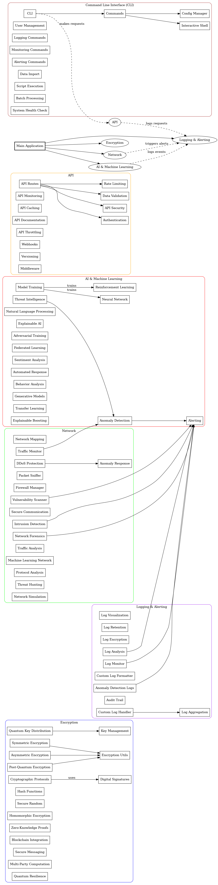

# System Architecture Overview

## Introduction
This document provides an overview of the architecture of the Quantum Sentinel framework, detailing its components and their interactions.

## Components
- **Encryption Module**: Implements quantum and classical encryption algorithms.
- **AI Module**: Contains AI-driven threat detection components.
- **Network Module**: Tools for network monitoring and analysis.
- **API Module**: RESTful API for external integrations.
- **CLI Module**: Command-line interface for user interaction.
- **Logging Module**: Handles logging and monitoring functionalities.

## Architecture Diagram

 

## Design Principles
- **Modularity**: Each component is designed to be independent and reusable.
- **Scalability**: The architecture supports scaling to handle increased loads.
- **Security**: Security is integrated at every layer of the architecture.
